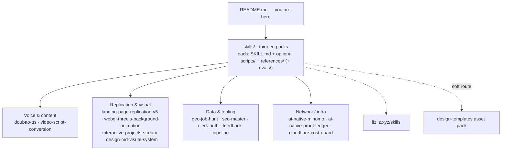

# Agent Skills

Clone-and-use skill packs for AI coding assistants — Claude Code, Cursor, Codex, Hermes, or any agent that reads a `SKILL.md`. Thirteen packs in `skills/`, each just a folder. No installers, no frameworks, no signup.

Also published on **[lizliz.xyz/skills](https://lizliz.xyz/skills)** — same packs, browsable online.



## What This Does

**Agent skills are instruction packs for coding AIs.** Instead of re-explaining your process every session — "capture the page, check density, verify offline" — you hand the agent a skill folder and it follows the workflow, runs the scripts, and hits the same gates you would.

These packs come from real pipelines on lizliz.xyz: they were built to get actual work done, then packaged so anyone can reuse them. **AI-Native Proof Ledger** is a researched reference skill; **Cloudflare Cost Guard** combines official documentation with reviewed operational lessons; runtime coverage and delivery still require acceptance. Neither is presented as a production-validated pipeline. A skill is just a folder — `SKILL.md` (the workflow map) plus optional `scripts/` and `references/` that the agent loads when it needs them.

## The Packs

<p align="center">
  
  
  
  
  
  
  
  
  
</p>

- **Doubao TTS** — Turn articles into spoken audio, dual-speaker podcasts, and ASR transcripts via Volcengine 豆包语音 · [doubao-tts/](skills/doubao-tts/)
- **Geo Job Hunt** — Find jobs inside a map radius — Amap fence + Liepin hiring, batch apply with rate-limit guardrails · [geo-job-hunt/](skills/geo-job-hunt/)
- **Landing Replication v5** — Copy a marketing landing page with measurable gates: capture, density, micro-parity, offline behavior probes · [landing-page-replication-v5/](skills/landing-page-replication-v5/)
- **Video Script Conversion** — Rebuild, refine, and audit spoken-voice scripts from articles — five seconds decide if viewers stay · [video-script-conversion/](skills/video-script-conversion/)
- **DESIGN.md Visual System** — Write implementation-grade DESIGN.md — YAML tokens plus the judgment prose agents need to ship UI without inventing taste · [design-md-visual-system/](skills/design-md-visual-system/)
- **WebGL Three.js Background Animation** — WebGL that blends into the page — config-driven, GPU-budgeted, full lifecycle hygiene · [webgl-threejs-background-animation/](skills/webgl-threejs-background-animation/)
- **Interactive Projects Stream** — Continuous clickable content stream — lane-track transport, accordion-style skill popups, D/H/P previews, zero deps · [interactive-projects-stream/](skills/interactive-projects-stream/)
- **SEO Master** — Full-site SEO/GEO audit plus generative-engine citation measurement — evidence ladder, not vibes · [seo-master/](skills/seo-master/)
- **GitHub Telegram Feedback Pipeline** — Same-origin CF Pages feedback → GitHub Issues and/or Telegram; quiet bilingual product sheet, not a SaaS FAB · [github-telegram-feedback-pipeline/](skills/github-telegram-feedback-pipeline/)
- **Clerk Auth** — Add Clerk authentication via the Clerk CLI — Windows-capable wrapper, split credential storage, Next.js matcher check · [clerk-auth/](skills/clerk-auth/)
- **AI-Native Mihomo** — Headless mihomo (Clash Meta) core + REST API as the agent control surface — self-heal, proxy doctrine, TUN debug playbook, runbook · [ai-native-mihomo/](skills/ai-native-mihomo/)
- **AI-Native Proof Ledger** — Tamper-evident, independently verifiable history for SaaS and agents — mechanism ladder L0–L5, witnessed checkpoints, anchoring, claim rubric · [ai-native-proof-ledger/](skills/ai-native-proof-ledger/)
- **Cloudflare Cost Guard** — Audit runaway billing risks and adapt quiet monitoring: native alerts first, hourly routine checks, evidence-based coverage and safe handoffs. Merged workflow with frequency-migration and delivery scenarios; no bundled monitoring daemon · [cloudflare-cost-guard/](skills/cloudflare-cost-guard/) · [cross-check report](docs/cloudflare-cost-guard-crosscheck-v0.2.0.md)

## Key Features

- **Clone and use** — A pack is a folder: copy it into your agent's skills directory, done. No npm, no build step, no config.
- **Agent-agnostic** — Any coding agent that reads `SKILL.md` can follow the workflow; scripts are stdlib-only Python where possible.
- **Evidence-led** — Execution packs include probes and checks where useful; reference and workflow packs state their validation requirements and limits.
- **Validation is explicit** — Production pipeline packs, researched references, and initial workflows are identified separately.
- **Free, MIT** — Use it, modify it, share it.

## Installation

Pick one pack, or grab everything:

```bash
# Everything at once
git clone https://github.com/lizliz404/agent-skills.git
# ...then copy the pack folders you want into your agent's skills directory

# Or cherry-pick one pack straight into place
git clone --depth 1 https://github.com/lizliz404/agent-skills.git
cp -r agent-skills/skills/doubao-tts ~/.claude/skills/
```

Where "your agent's skills directory" lives:

| Agent | Path |
|---|---|
| Claude Code | `~/.claude/skills/` |
| Cursor | `~/.cursor/skills/` |
| Hermes | `~/.hermes/skills/` |
| Codex / others | check the agent's docs — most read `SKILL.md` from a skills folder |

Some packs need environment variables (`AMAP_MAPS_API_KEY`, `MCP_LIEPIN_API_KEY`, `DOUBAO_API_KEY`) — each pack's README explains what it needs and where to get it.

## Usage

Point your agent at the skill and let it work:

```text
Use the landing-page-replication-v5 skill to copy https://example.com — capture, audit, and report the fidelity gates.
```

```text
用 geo-job-hunt 技能：在天河区半径 5 公里内找前端岗位，反向确认公司，列 10 个可投的。
```

Each pack's `SKILL.md` starts with a workflow map, so the agent knows what to do without you spelling it out every time.

## How Each Pack Is Structured

Every pack follows the same shape — **progressive disclosure**:

| Piece | Purpose |
|---|---|
| `SKILL.md` | The workflow map and rules — loaded when the skill is invoked |
| `scripts/` | Run when a step needs computation (capture, transcribe, count, apply) |
| `references/` | Deep notes loaded on demand: API details, cases, checklists |
| `evals/` | Where provided: behavior scenarios or executable checks; declared cases alone are not passing test evidence |

The agent reads the map first and pulls in only the files the current task needs.

## Philosophy

This repo exists because of a few beliefs:

1. **The fastest way to learn a process is to watch someone who already runs it.** These skills are that, packaged.
2. **Dependencies are debt.** A stdlib-only Python script will work in ten years. A pinned framework will not.
3. **Vibes are not verification.** Every pack has numbers you can check: density scores, character counts, probe results.
4. **Clone and use is the whole point.** If a skill needs a ceremony to install, it is not a skill, it is a project.

## Credits

Created by [@lizliz404](https://x.com/lizliz404).

## Related

- Asset pack (soft route): [lizliz404/design-templates](https://github.com/lizliz404/design-templates) · map `templates/sibling-routes.md`
- Landing replication loads pack orbs/shaders/Beautiful UI when `WEBGL_THEATER` or agent chrome is the mechanism — it does not vendor those folders.

## License

MIT — Use it, modify it, share it.
